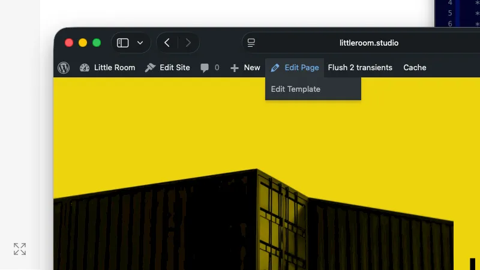

# Template Jump

Adds an "Edit Template" link to the WordPress admin bar that takes you directly to the Site Editor with the active block template already loaded.

Solves the problem where you notice something you want to fix, drill through the dashboard to the Site Editor, and then completely forget what you were trying to change.



## Requirements

- WordPress 6.8 or later
- PHP 8.3 or later
- Block theme (Full Site Editing)

## Installation

Download the latest release and upload the `template-jump` folder to `/wp-content/plugins/`, then activate through the WordPress admin.

Or clone this repository:

```bash
cd wp-content/plugins
git clone https://github.com/littleroomstudio/template-jump.git
```

This plugin supports [Git Updater](https://git-updater.com/) for automatic updates.

## Usage

While logged in and viewing any page, post, or custom post type on the front end, hover over "Edit Page" (or "Edit Post") in the admin bar. Click "Edit Template."

The Site Editor opens with the correct template already loaded. The one WordPress is actively using for that specific page.

The link only appears when:
- You're viewing the front end (not wp-admin)
- You have the `edit_theme_options` capability
- Your site is using a block theme
- WordPress has identified an active template for the current page

## How It Works

The plugin hooks into `admin_bar_menu` with a late priority and adds a child node under the existing "Edit" menu item. It uses WordPress's `$_wp_current_template_id` global to identify the active template, then constructs a direct link to the Site Editor with the correct `postType`, `postId`, and `canvas` parameters.

## License

GPL-3.0-or-later
